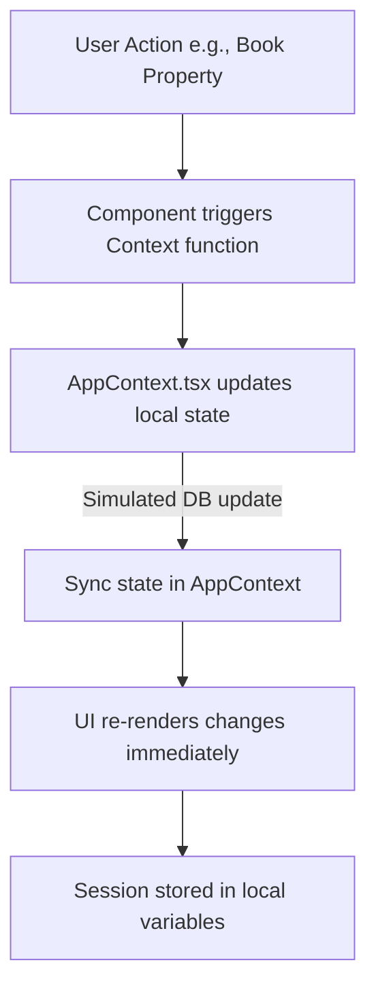

# 🚀 What Is DevFlow-AI? (Mission & Vision)

DevFlow-AI is an AI-powered developer workspace designed to simplify the software development lifecycle. The flagship module within DevFlow-AI is the **Airbnb Clone**—a production-ready booking platform UI built with modern architecture. This document explains the codebase, data structures, and architecture of the Airbnb Clone module.

---

## 📖 Table of Contents

1. [Architecture Overview](#1-architecture-overview)
2. [Folder Structure & Key Files](#2-folder-structure--key-files)
3. [Client-Side Data Flow](#3-client-side-data-flow)
4. [Routing and Pages](#4-routing-and-pages)
5. [Global State Management](#5-global-state-management)
6. [Best Practices & Contributing Checklist](#6-best-practices--contributing-checklist)

---

## 1. Architecture Overview

The **Airbnb Clone** is a frontend application built using:
- **React 18**: Component-based UI library.
- **TypeScript**: Strict type-checking for robust code.
- **Vite**: Rapid asset compilation and bundling.
- **Tailwind CSS**: Rapid styling using utility classes.
- **React Router DOM**: Declarative client-side routing.

Currently, all page requests and operations are fully simulated on the client side using:
- A local database mockup containing comprehensive data for properties, bookings, users, and categories.
- React Context API for global state storage, mimicking server responses and authentication sessions.

---

## 2. Folder Structure & Key Files

The codebase under `Airbnb_Clone/src` is structured as follows:

```
src/
├── components/          # Reusable UI widgets
│   ├── AuthModal.tsx    # Simulates registration & login
│   ├── Header.tsx       # Search triggering & navigation bar
│   ├── Footer.tsx       # Links & copyright info
│   ├── SearchBar.tsx    # Location, guest, and date query handler
│   └── PropertyCard.tsx # Listing overview card representation
├── context/
│   └── AppContext.tsx   # Global state (user, listings, bookings, favorites)
├── data/
│   └── mockData.ts      # Heavy dummy dataset representing DB entries
├── pages/
│   ├── Home.tsx         # Main landing page with filters
│   ├── PropertyDetail.tsx # Detailed view of a single listing
│   ├── HostDashboard.tsx # Host's property listing and income analytics
│   ├── Search.tsx       # Query-based listing search results
│   └── Sitemap.tsx      # Comprehensive list of links
├── types/
│   └── index.ts         # TS schemas (User, Listing, Booking, Review, etc.)
├── App.tsx              # Root component config containing router configurations
└── main.tsx             # DOM mounting entrypoint
```

---

## 3. Client-Side Data Flow

In the absence of a live database, actions follow a local state loop:



- **Authentication**: Opening `AuthModal` allows registering/logging in as a Guest or Host. Upon success, user profile metadata is committed to the application context.
- **Booking**: A Guest makes a reservation on the `PropertyDetail` page. It calculates taxes/fees, checks availability, and registers a new simulated booking object in the Context.
- **Hosting**: A Host adds, modifies, or deletes a listing on the `HostDashboard`. These changes are appended to the listings array in global state.

---

## 4. Routing and Pages

The routing structure in `Airbnb_Clone/src/App.tsx` contains multiple endpoints:
- `/` - Main landing page showcasing listings filtered by categories.
- `/property/:id` - Dynamic route displaying details, gallery, map coordinates, reviews, and the booking widget.
- `/search` - Displays listings filtering by destination search parameters.
- `/host-dashboard` - Analytical summary showing listings, bookings, and revenue for Hosts.
- `/profile` - User settings, role toggle, and active bookings.
- `/company-details`, `/privacy`, `/terms`, `/services` - Informational/corporate pages.

---

## 5. Global State Management

The `AppContext` (`src/context/AppContext.tsx`) exposes variables and functions to sub-components:
- `user`: Active authenticated user object.
- `listings`: Array of active property listings.
- `bookings`: Array of recorded booking transactions.
- `wishlist`: User's bookmarked property IDs.
- `login(email, password, role)`: Simulates session authentication.
- `logout()`: Clears active user and resetting session parameters.
- `addListing(listingData)`: Inserts a new listing.
- `bookProperty(bookingData)`: Commits a new booking structure.

---

## 6. Best Practices & Contributing Checklist

When modifying or contributing to the **Airbnb Clone**:
1. **Type Definition First**: Always define/update typing schemas inside `src/types/index.ts` when adding new properties or object templates.
2. **Context Synchronization**: If you modify local arrays, verify the updates propagation inside `src/context/AppContext.tsx`.
3. **Tailwind Responsiveness**: Ensure components look good on mobile and desktop by using Tailwind responsive designators (`sm:`, `md:`, `lg:`).
4. **Clean Code**: Run `npm run lint` inside the `Airbnb_Clone` directory to check for ESLint warnings before committing.
